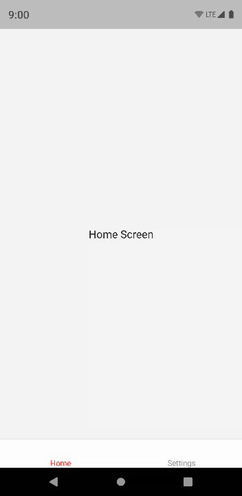

# RNThemeProvider Example

> A React Navigation 5 example which support automatic system dark mode or user selected theme options.

- Only shows system option for OS which are Android 10 or iOS 13 and higher

## Note

> Add this code into `android/app/src/main/java/com/themeexample/MainActivity.java`

```java

// Add this import statements
import android.content.Intent;
import android.content.res.Configuration;

public class MainActivity extends ReactActivity {

  // Add this override statement
  @Override
    public void onConfigurationChanged(Configuration newConfig) {
      super.onConfigurationChanged(newConfig);
      getReactInstanceManager().onConfigurationChanged(this, newConfig);
  }
}
```

## Demo

### Android 9



### Android 10


### iOS 13

